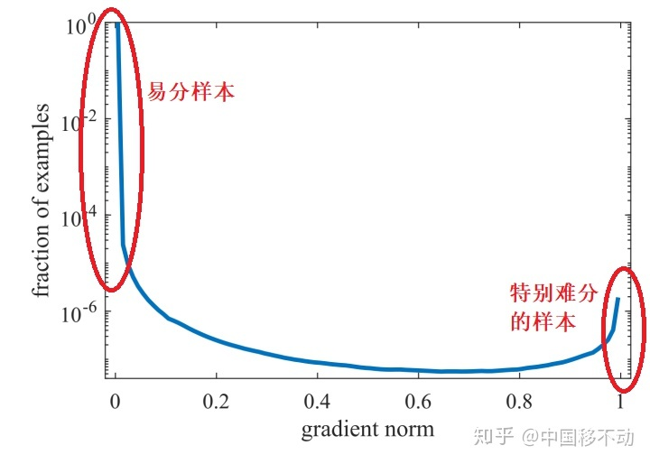

--------------------------------

**样本权重，是损失函数的核心。**

--------------------------------

[5分钟理解Focal Loss与GHM——解决样本不平衡利器](https://zhuanlan.zhihu.com/p/80594704)

# 1. 背景
## 1.1 样本不均衡
+ 正负样本不均衡
+ 样本的难易程度不均衡
## 1.2 现实
**U型分布：**

# 2 Focal Loss
## 2.1 背景
解决 **难易样本数量不平衡** 的问题
## 2.2 损失函数
1. 交叉熵
$$
L_{CE}(p, y) =
    \begin{cases}
        -\log{p}        \qquad y = 1    \\
        -\log{(1 - p)}  \qquad y = 0
    \end{cases}     \tag{2-2-1}
$$
2. 解决正负样本不均衡的问题
$$
L_{CE}(p, y) = \begin{cases}
                    - \alpha \log{p}    \qquad y = 1    \\
                    -(1 - \alpha) \log{(1 - p)} \qquad y = 0
               \end{cases}      \tag{2-2-2}
$$

其中，$\alpha$ 是正样本的样本权重，通常取值 $F/(P + F)$
&emsp;&emsp;**调节正负样本的样本权重**，相对降低负类样本的权重，提高正类样本的权重(默认负类样本数量较多，正类样本数量较少)。此处有个假设：同一个类别的样本是同质化的，所有正类样本(或负样本)的权重相同，无差别地对待同一个类别的所有样本。

&emsp;&emsp;**$\alpha$ 解决了正负样本不均衡的问题，没有解决难易样本不均衡的问题**
## 2.3 问题
&emsp;&emsp;易分样本的数量相对太多，主导了总的损失，且对模型的提升非常小。
## 2.4 解决方案
&emsp;&emsp;`Focal Loss` 的作者认为：**易分样本对模型的提升非常小，模型应该主要关注那些难分样本(这个假设是有问题的，是 GHM 的主要改进对象)**

&emsp;&emsp;`Focal Loss` 思想：降低高置信度样本的样本权重
$$
L_{FL} = \begin{cases}
            -(1 - p)^{\gamma} \log{p}  \qquad y = 1    \\
            -p^{\gamma} \log{p} \qquad\qquad \;\; y = 0
            \end{cases} \tag{2-3-1}
$$

&emsp;&emsp;综合考虑正负样本不均衡和难易样本不均衡的，最终形态的 `Focal Loss`
$$
L_{FL} =    \begin{cases}
                -\alpha (1 - p)^{\gamma} \log{p}    \qquad \qquad \;\;y = 1    \\
                -(1 - \alpha) p^{\gamma} \log{(1 - p)}  \qquad y = 0
            \end{cases}     \tag{2-3-2}
$$
实验表明，$\gamma = 2, \alpha = 0.25$ 时效果最佳。

**本质：样本权重**
$$
\text{Sample\_{Weight}}(x_i) =
    \begin{cases}
        \alpha (1 - p_i)^{\gamma} \qquad y_i = 1    \\
        (1 - \alpha) p_i^{\gamma} \qquad\; y_i = 0
    \end{cases}
$$

再把 $\text{BCE}$ 乘以样本权重就行了
$$
L_{FL}(p_i, y_i) = \text{Sample\_{Weight}}(x_i) \cdot \text{BCE}(p_i, y_i) =
                    \begin{cases}
                        \alpha (1 - p_i)^{\gamma} \cdot \log{p_i} \qquad\qquad\; y_i = 1    \\
                        (1 - \alpha) p_i^{\gamma} \cdot \log{(1 - p_i)} \qquad y_i = 0
                    \end{cases}
$$

# 3 GHM
## 3.1 背景
1. **异常样本**：样本中存在离群点，即标注错误的样本，这些样本可能会破坏已有的模型。
2. **超参敏感**：$\alpha$ 和 $\gamma$ 的取值全凭实验得出，且两者的取值会相互影响，难以确定。
## 3.2 改进
&emsp;&emsp;`Focal Loss` 是从 置信度 $p$ 的角度入手衰减损失，而 `GHM` 是一定范围置信度 $p$ 的样本数量的角度衰减损失。
### 3.2.1 梯度模长 $g$
$$
g(p_i, y_i) = \mid p_i - y_i \mid =
    \begin{cases}
        1 - p   \qquad\; y_i = 1    \\
        p       \qquad\qquad y_i = 0
    \end{cases}
$$
&emsp;&emsp;梯度模长 $g$ 正比于检测的难易程度，**$g$ 越大，检测难度越大**。

梯度模长，这个名称来源于交叉熵损失求梯度
$$
L_{CE}(p_i, y_i) = \begin{cases}
                        -\log{p}    \qquad\qquad\;  y_i = 1    \\
                        -\log{(1 - p)}  \qquad y = 0
                    \end{cases}
$$
设 $p = \sigma(x)$，我们知道
$$
{\partial{p} \over \partial{x}} = p(1 - p)
$$
那么
$$
\begin{aligned}
{\partial{L_{CE}} \over \partial{x}} &= {{\partial{L_{CE}}} \over {\partial{p}}} \cdot {{\partial{p}} \over {\partial{x}}}  \\
                                    &= \begin{cases}
                                        p - 1   \qquad\; y_i = 1  \\
                                        p       \qquad\qquad y_i = 0 \\
                                    \end{cases} \\
    &= p_i - y_i
\end{aligned}
$$
**梯度模长 $g$ 定义为交叉熵损失 ${L_{CE}}$ 对 $x$ 的偏导**
$$
g = \mid
        {{\partial{L_{CE}}} \over {\partial{x}}}
    \mid
$$
&emsp;&emsp;**$U$ 型分布**：梯度模长接近于 $0$ 的样本数量最多，随着梯度模长的增长，样本数量迅速减少，但是在摸长接近于 $1$ 时，样本数量也挺多。
## 3.4 思想
**中庸：即不过多关注易分样本，也不过分关注特别难的样本(离群点)。**

&emsp;&emsp;这些利群点的梯度摸长 d 比一半的样本大很多，如果模型被迫去关注这些样本，反而可能降低模型的准确度！而且，这些样本的数量也不少。

&emsp;&emsp;怎么同时衰减易分样本和特别难分样本？谁的数量多就衰减谁！定义一个变量，衡量出一定范围内的样本数量。

**梯度密度 $\text{GD}(g)$**
$$
\text{GD}(g) = {1 \over {l_{\varepsilon}(g)}} \sum_{k = 1}^{N}{\delta}_{\varepsilon}(g_k, g)
$$
${\delta}_{\varepsilon}(g_k, g)$ 为样本集中，梯度模长分布在 $(g - {\delta}_{\varepsilon} / 2, g + {\delta}_{\varepsilon} / 2)$ 范围内的个数，${l_{\varepsilon}(g)}$ 代表了区间 $(g - \varepsilon / 2, g + \varepsilon / 2)$ 的长度。

&emsp;&emsp;梯度密度 $\text{GD(g)}$ 的物理含义：单位梯度模 $g$ 部分的样本个数。
## 3.5 样本权重
$$
\text{Sample\_{Weight}}(x_i) = {1 \over {\text{GD}}(g_i)}
$$
## 3.6 损失函数
$$
\begin{aligned}
L_{GHM-C}(p_i, y_i) &= L_{CE}(p_i, y_i) \cdot \text{Sample\_{Weight}}(x_i)  \\
                    &= L_{CE}(p_i, y_i) \cdot {1 \over {\text{GD}}(g_i)}
\end{aligned}
$$
